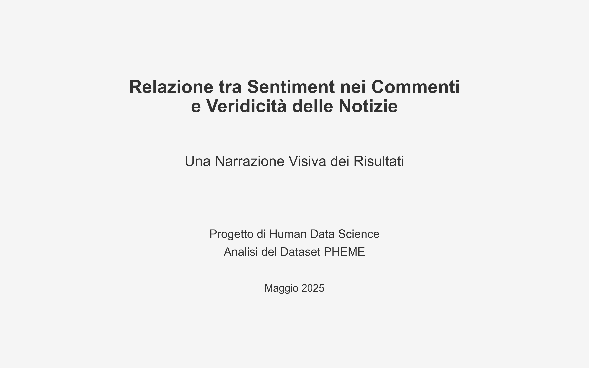

# Relazione tra Sentiment nei Commenti e Veridicità delle Notizie
# Analisi del Dataset PHEME

**Università:** Corso di Digital Humanities  
**Data:** 3 maggio 2025  
**Autore:** Simone  

---

## Indice Generale

1. [Introduzione](01_introduzione.md)
   - Contesto e motivazione
   - Il problema della disinformazione online
   - Obiettivi dello studio
   - Ipotesi di ricerca

2. [Dataset e Metodologia](02_dataset_metodologia.md)
   - Dataset PHEME
   - Preprocessing dei dati
   - Estrazione delle feature
   - Metodi di analisi

3. [Analisi Esplorativa](03_analisi_esplorativa.md)
   - Statistiche descrittive
   - Distribuzione delle feature
   - Pattern principali

4. [Analisi Statistica](04_analisi_statistica.md)
   - Test di ipotesi
   - Correlazioni
   - Significatività e effect size

5. [Modelli Predittivi](05_modelli_predittivi.md)
   - Regressione logistica
   - Random Forest
   - Confronto tra modelli
   - Importanza delle feature

6. [Risultati e Discussione](06_risultati_discussione.md)
   - Sintesi dei risultati principali
   - Interpretazione nel contesto della ricerca
   - Rilevanza pratica e teorica

7. [Limitazioni e Validazione](07_limitazioni_validazione.md)
   - Limitazioni metodologiche
   - Validazione dei risultati
   - Generalizzabilità

8. [Conclusioni](08_conclusioni.md)
   - Sintesi finale
   - Implicazioni
   - Direzioni future

9. [Bibliografia](09_bibliografia.md)

---

## Sommario Esecutivo

Questo studio esplora la relazione tra i pattern di sentiment espressi nei commenti alle notizie e la veridicità dell'informazione originale, utilizzando il dataset PHEME di conversazioni Twitter. Attraverso un approccio multi-metodologico che combina analisi statistica e machine learning, abbiamo indagato se esistano differenze sistematiche nelle reazioni linguistiche e affettive alle notizie vere rispetto a quelle false.

I risultati mostrano differenze statisticamente significative ma con effect size trascurabile nelle feature di sentiment tra i commenti a notizie vere e false. I modelli non lineari (Random Forest) catturano relazioni più complesse rispetto ai modelli lineari (Regressione Logistica), con un miglioramento dell'AUC da 0.54 a 0.93. Le feature di leggibilità e acculturazione, in particolare il `culture_score`, si rivelano più predittive rispetto alle pure feature di sentiment.

Questi risultati suggeriscono che l'analisi del sentiment da sola è insufficiente per identificare efficacemente le fake news, evidenziando la necessità di approcci multidimensionali che considerino la complessità linguistica e le dinamiche conversazionali. Lo studio contribuisce alla comprensione dei meccanismi di diffusione della disinformazione online e alle strategie per contrastarla.
