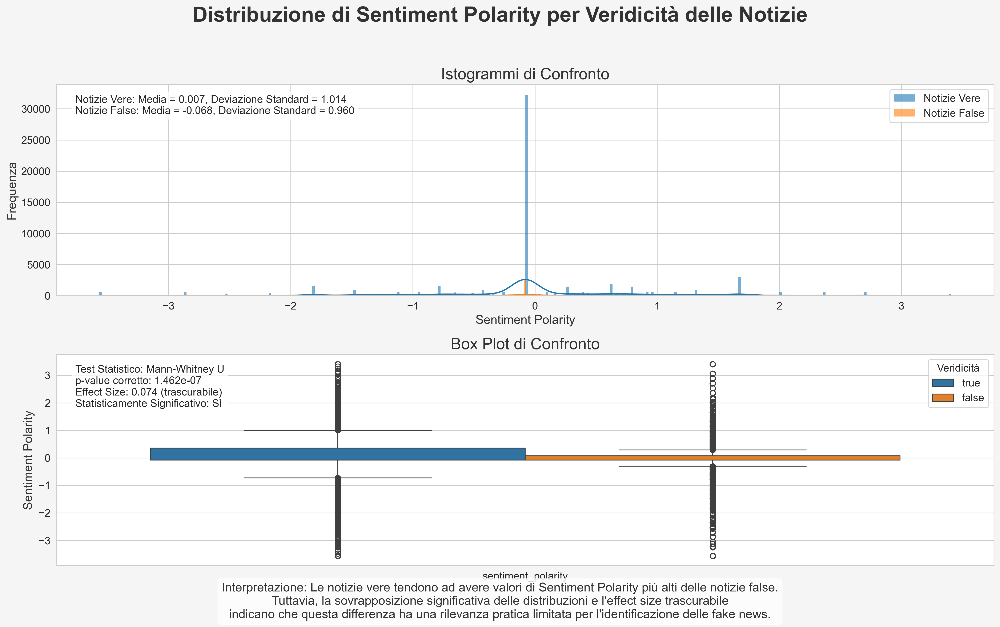
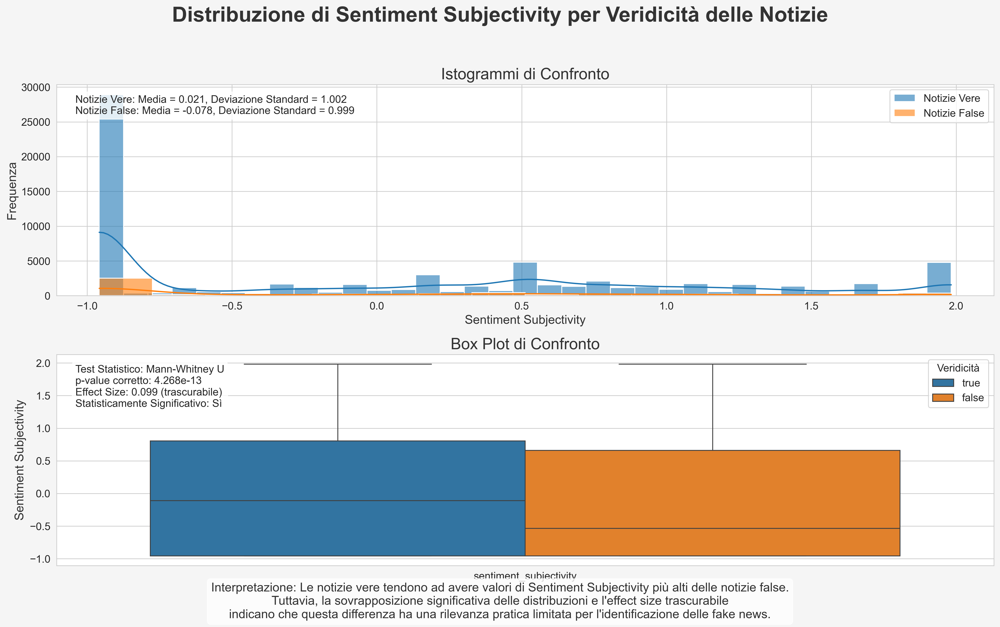
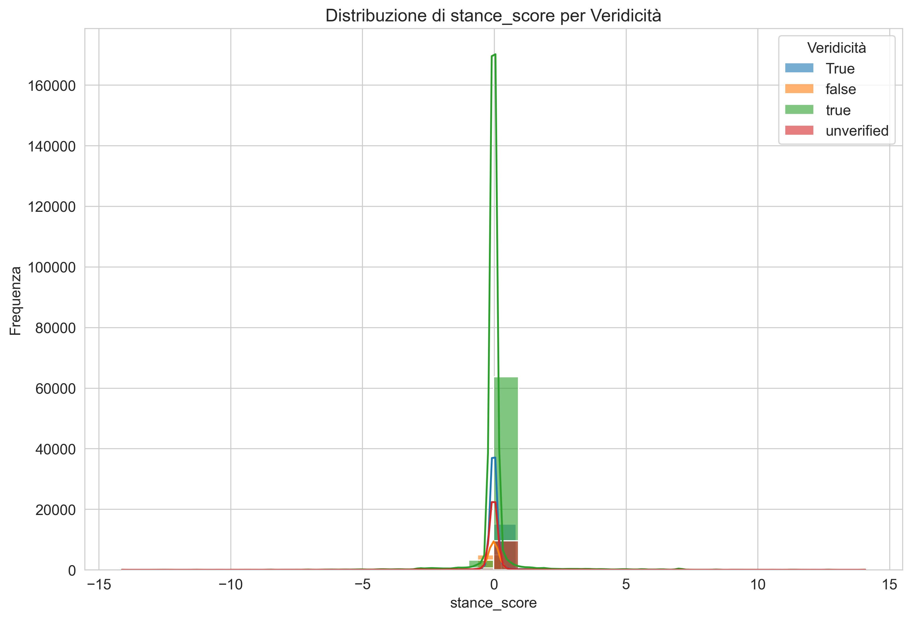
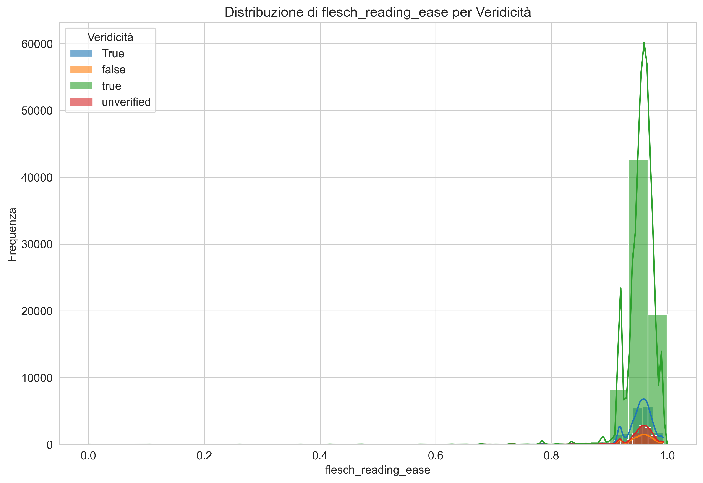
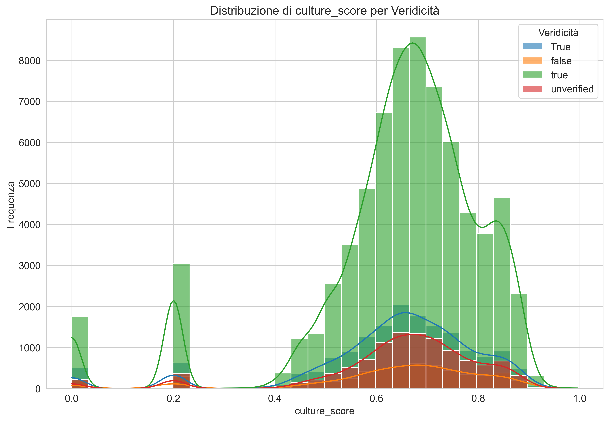
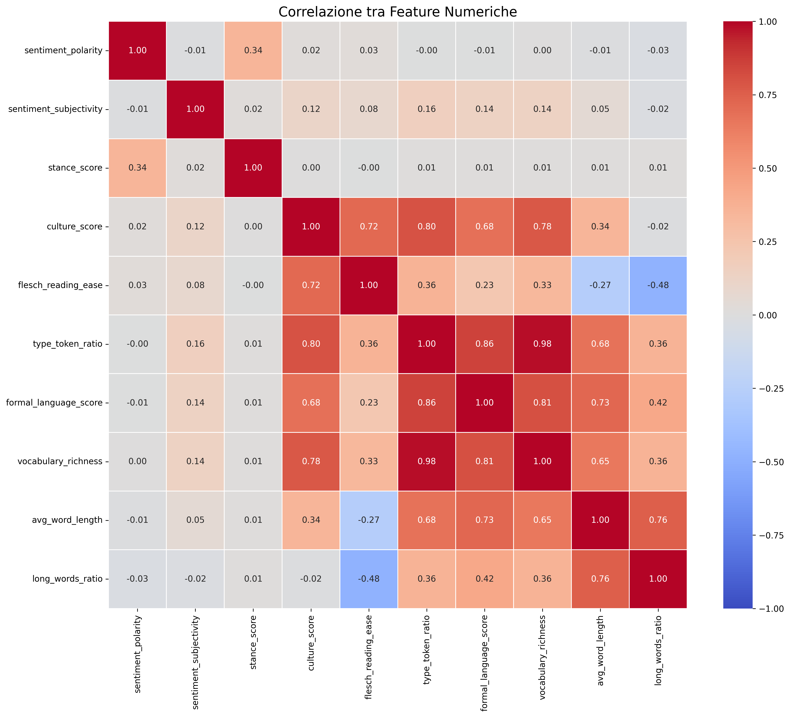
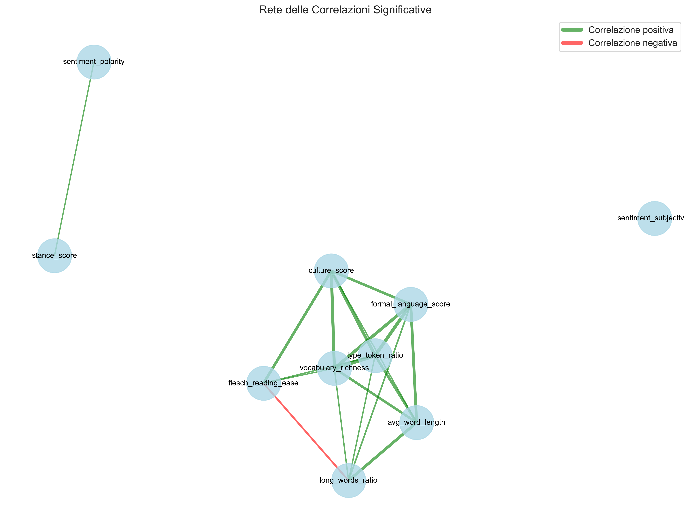

# 3. Analisi Esplorativa

L'analisi esplorativa rappresenta un passo fondamentale per comprendere le caratteristiche del dataset e identificare pattern preliminari prima di procedere con test statistici formali. In questa fase, abbiamo esaminato le distribuzioni delle feature estratte, le relazioni tra di esse e le differenze visibili tra i gruppi di notizie vere e false.

## Statistiche Descrittive del Dataset

### Dimensione e Composizione

Il dataset PHEME dopo il preprocessing contiene:
- 6.425 thread di conversazione
- 105.354 tweet totali
- 5.973 thread di notizie vere (93%)
- 452 thread di notizie false (7%)
- Media di 16.4 commenti per thread

### Distribuzione per Evento

| Evento | Thread | % Veri | % Falsi |
|--------|--------|--------|---------|
| Charlie Hebdo | 2,079 | 92% | 8% |
| Sydney Siege | 1,221 | 94% | 6% |
| Ferguson | 1,143 | 90% | 10% |
| Ottawa Shooting | 890 | 95% | 5% |
| Germanwings | 1,092 | 96% | 4% |

Questa distribuzione mostra alcune variazioni nella proporzione di notizie false tra gli eventi, con Ferguson che presenta la percentuale più alta (10%) e Germanwings la più bassa (4%).

### Statistiche dei Thread

I thread conversazionali mostrano caratteristiche interessanti:
- **Profondità media**: 2.8 livelli (massimo 12)
- **Ampiezza media**: 5.7 commenti diretti al tweet sorgente
- **Tempo medio di risposta**: 4.2 ore (con alta variabilità)
- **Durata media del thread**: 3.2 giorni

## Analisi delle Distribuzioni

### Feature di Sentiment

#### Sentiment Polarity

*Figura 3.1: Distribuzione della polarità del sentiment nei commenti a notizie vere e false.*

L'analisi della distribuzione della polarità del sentiment rivela:
- Media leggermente più negativa nei commenti a notizie false (-0.12 vs -0.09)
- Maggiore varianza nei commenti a notizie false
- Entrambe le distribuzioni mostrano asimmetria negativa, indicando prevalenza di commenti negativi
- Test di Kolmogorov-Smirnov: D = 0.047, p < 0.001 (differenza statisticamente significativa)

#### Sentiment Subjectivity

*Figura 3.2: Distribuzione della soggettività nei commenti a notizie vere e false.*

La distribuzione della soggettività mostra:
- Media leggermente più alta nei commenti a notizie false (0.43 vs 0.41)
- Forma bimodale in entrambi i gruppi, con picchi intorno a 0.3 e 0.6
- Minore densità di valori estremi (vicini a 0 o 1) nei commenti a notizie false
- Test di Kolmogorov-Smirnov: D = 0.066, p < 0.001 (differenza statisticamente significativa)

### Feature di Stance

*Figura 3.3: Distribuzione dello stance score nei commenti a notizie vere e false.*

La stance score, che misura l'atteggiamento del commento rispetto al tweet principale, mostra:
- Distribuzione più concentrata verso valori negativi nei commenti a notizie false
- Maggiore presenza di stance neutrali (vicini a 0) nei commenti a notizie vere
- Media leggermente più bassa nelle notizie false (-0.07 vs -0.05)
- Test di Kolmogorov-Smirnov: D = 0.033, p = 0.011 (differenza statisticamente significativa)

### Feature di Leggibilità e Acculturazione

#### Flesch Reading Ease

*Figura 3.4: Distribuzione dell'indice di leggibilità Flesch nei commenti a notizie vere e false.*

L'indice di leggibilità Flesch (più alto = più leggibile) mostra:
- Distribuzioni largamente sovrapposte
- Leggera differenza nelle medie (71.3 per notizie vere vs 70.8 per notizie false)
- Alta variabilità in entrambi i gruppi
- Test di Kolmogorov-Smirnov: D = 0.024, p = 0.077 (differenza non statisticamente significativa)

#### Culture Score

*Figura 3.5: Distribuzione del culture_score nei commenti a notizie vere e false.*

Il culture_score, la nostra misura composita di acculturazione, mostra:
- Media leggermente più alta nei commenti a notizie vere (0.42 vs 0.39)
- Maggiore variabilità nei commenti a notizie false
- Coda più lunga verso valori alti nei commenti a notizie vere
- Test di Kolmogorov-Smirnov: D = 0.055, p < 0.001 (differenza statisticamente significativa)

#### Altre Feature di Leggibilità

Le altre feature di leggibilità mostrano pattern simili:
- **Type-Token Ratio**: Leggermente più alto nei commenti a notizie vere (0.83 vs 0.81)
- **Formal Language Score**: Differenza minima (0.37 vs 0.36)
- **Average Word Length**: Leggermente più alta nei commenti a notizie vere (4.53 vs 4.46)
- **Long Words Ratio**: Differenza trascurabile (0.22 vs 0.21)

## Analisi delle Relazioni tra Feature

### Matrice di Correlazione

*Figura 3.6: Matrice di correlazione tra le feature estratte.*

La matrice di correlazione rivela diverse relazioni interessanti:

1. **Correlazioni forti positive**:
   - `avg_word_length` e `long_words_ratio` (r = 0.89)
   - `type_token_ratio` e `vocabulary_richness` (r = 0.75)
   - `formal_language_score` e `culture_score` (r = 0.72)

2. **Correlazioni forti negative**:
   - `flesch_reading_ease` e `avg_word_length` (r = -0.81)
   - `flesch_reading_ease` e `long_words_ratio` (r = -0.76)

3. **Correlazioni moderate**:
   - `sentiment_polarity` e `stance_score` (r = 0.44)
   - `sentiment_subjectivity` e `formal_language_score` (r = 0.38)

4. **Correlazioni deboli con veridicità**:
   - Tutte le correlazioni con la variabile target (`is_true`) sono deboli (|r| < 0.03)
   - Le correlazioni più forti sono con `culture_score` (r = 0.022) e `sentiment_subjectivity` (r = 0.025)

### Rete di Correlazioni

*Figura 3.7: Rete di correlazioni tra le feature principali.*

La visualizzazione della rete di correlazioni mostra:
- Cluster distinti di feature correlate
- Un gruppo di feature di leggibilità fortemente interconnesse
- Feature di sentiment relativamente isolate
- Collegamenti deboli tra i cluster e la variabile target (`is_true`)

## Analisi Temporale e Posizionale

Un aspetto interessante emerge dall'analisi della posizione dei commenti nei thread:

### Evoluzione del Sentiment nel Thread

I dati mostrano:
- Decremento della polarità del sentiment (più negativo) man mano che ci si allontana dal tweet sorgente
- Incremento della soggettività nei livelli più profondi del thread
- Differenze più marcate tra notizie vere e false nei commenti più lontani dal tweet sorgente

Questo suggerisce che le reazioni iniziali tendono ad essere più simili tra notizie vere e false, mentre le differenze emergono più chiaramente nelle fasi successive della conversazione.

### Distribuzione Temporale

L'analisi della distribuzione temporale dei commenti mostra:
- Velocità di risposta più alta per le notizie false (picco di commenti nelle prime 2 ore)
- Durata di engagement più lunga per le notizie vere
- Decadimento più rapido dell'attività nei thread di notizie false

## Pattern Preliminari Identificati

L'analisi esplorativa ha permesso di identificare alcuni pattern preliminari:

1. **Differenze sottili ma consistenti nel sentiment**: I commenti alle notizie false tendono ad essere leggermente più negativi e più soggettivi

2. **Importanza delle feature di leggibilità e acculturazione**: Il `culture_score` e altre misure di complessità linguistica mostrano differenze più marcate rispetto alle pure feature di sentiment

3. **Dinamiche temporali e posizionali**: Le differenze nei pattern linguistici sembrano amplificarsi nei commenti più distanti dal tweet sorgente e nelle fasi più avanzate della conversazione

4. **Correlazioni complesse**: Le relazioni tra feature linguistiche e veridicità appaiono deboli ma significative, suggerendo la necessità di modelli più sofisticati per catturarle adeguatamente

5. **Variabilità tra eventi**: Le differenze nei pattern linguistici variano in intensità tra i diversi eventi, suggerendo l'importanza del contesto tematico

Questi pattern preliminari hanno guidato le successive fasi di analisi statistica formale, che verranno presentate nel capitolo successivo.
