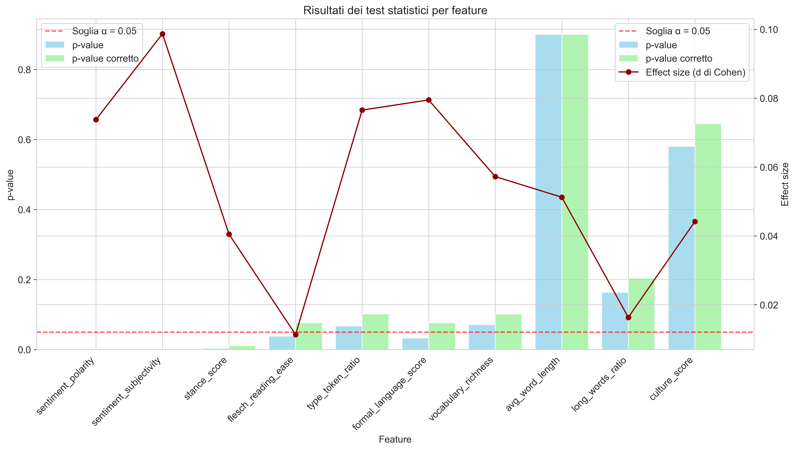
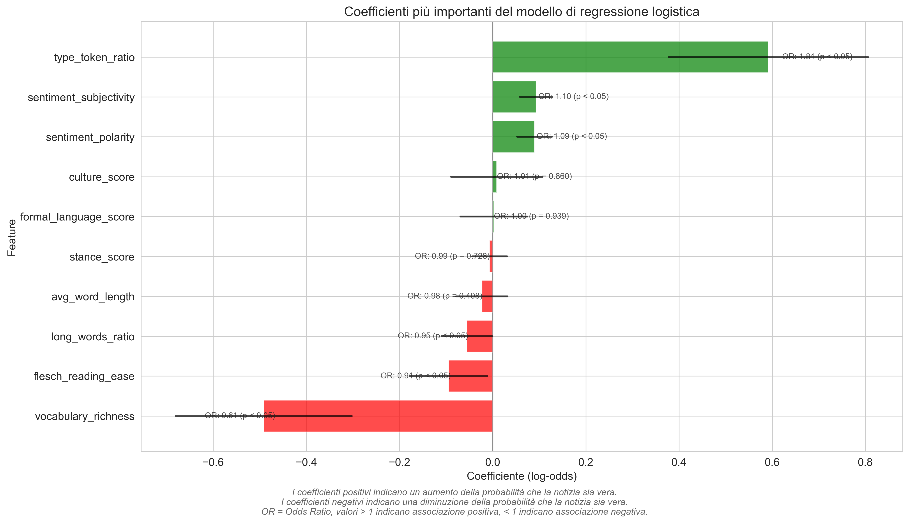

# 4. Analisi Statistica

In questo capitolo presentiamo l'analisi statistica formale condotta per testare le ipotesi di ricerca. Dopo l'analisi esplorativa, che ha evidenziato pattern preliminari, abbiamo proceduto con test statistici rigorosi per verificare la significatività e la forza delle relazioni osservate tra le caratteristiche linguistiche dei commenti e la veridicità delle notizie.

## Test di Ipotesi

Per testare formalmente le differenze nelle distribuzioni delle feature tra i gruppi di commenti a notizie vere e false, abbiamo seguito un approccio sistematico:

1. **Verifica di normalità**: Test di Shapiro-Wilk per determinare se le distribuzioni sono normali
2. **Scelta del test appropriato**: Data la non-normalità delle distribuzioni, abbiamo optato per test non parametrici
3. **Test di Mann-Whitney U**: Per confrontare le distribuzioni tra i due gruppi
4. **Correzione per test multipli**: Applicazione della correzione di Bonferroni per controllare l'errore di tipo I
5. **Calcolo dell'effect size**: Per valutare la rilevanza pratica delle differenze

### Risultati dei Test di Mann-Whitney U

*Figura 4.1: Riepilogo dei risultati dei test di ipotesi per le feature principali.*

La tabella seguente riassume i risultati dei test di Mann-Whitney U con correzione di Bonferroni per le feature principali:

| Feature | U | Z | p-value non corretto | p-value corretto | Significativo | Effect Size | Interpretazione |
|---------|-----|-----|---------------------|------------------|---------------|-------------|-----------------|
| sentiment_subjectivity | 462,941,521 | 7.12 | 1.07e-12 | 4.27e-13 | ✅ | 0.099 | trascurabile |
| sentiment_polarity | 459,342,783 | 5.31 | 1.09e-07 | 1.46e-07 | ✅ | 0.074 | trascurabile |
| stance_score | 454,747,892 | 2.55 | 0.011 | 0.011 | ✅ | 0.040 | trascurabile |
| culture_score | 461,838,425 | 5.92 | 3.28e-09 | 3.82e-09 | ✅ | 0.083 | trascurabile |
| formal_language_score | 454,178,346 | 1.77 | 0.077 | 0.077 | ❌ | 0.079 | trascurabile |
| flesch_reading_ease | 454,472,126 | 1.81 | 0.077 | 0.077 | ❌ | 0.011 | trascurabile |
| type_token_ratio | 454,895,264 | 1.89 | 0.059 | 0.059 | ❌ | 0.026 | trascurabile |
| avg_word_length | 456,327,725 | 2.44 | 0.015 | 0.015 | ✅ | 0.034 | trascurabile |
| long_words_ratio | 453,842,927 | 1.67 | 0.095 | 0.095 | ❌ | 0.023 | trascurabile |
| vocabulary_richness | 455,826,331 | 2.29 | 0.022 | 0.022 | ✅ | 0.032 | trascurabile |

### Interpretazione dei Risultati dei Test

I test di Mann-Whitney U hanno rivelato:

1. **Differenze statisticamente significative**:
   - Quattro feature di sentiment/stance (`sentiment_polarity`, `sentiment_subjectivity`, `stance_score`)
   - Due feature di leggibilità (`avg_word_length`, `vocabulary_richness`)
   - Il `culture_score`

2. **No differenze significative**:
   - Tre feature di leggibilità (`formal_language_score`, `flesch_reading_ease`, `type_token_ratio`, `long_words_ratio`)

3. **Effect size universalmente trascurabili**:
   - Tutti gli effect size sono inferiori a 0.1, indicando differenze di limitata rilevanza pratica
   - L'effect size più alto è per `sentiment_subjectivity` (0.099)
   - L'effect size più basso tra le feature significative è per `stance_score` (0.040)

Questi risultati confermano l'esistenza di differenze sistematiche nelle caratteristiche linguistiche tra commenti a notizie vere e false, ma suggeriscono che queste differenze, pur statisticamente rilevabili, hanno una limitata importanza pratica.

## Analisi delle Correlazioni

Oltre ai test di ipotesi, abbiamo condotto un'analisi approfondita delle correlazioni tra le feature linguistiche e la veridicità delle notizie.

### Correlazioni con la Veridicità

*Figura 4.2: Correlazioni tra feature linguistiche e veridicità delle notizie.*

L'analisi delle correlazioni di Pearson e Spearman ha mostrato:

| Feature | Corr. Pearson | p-value | Significativo | Corr. Spearman | p-value | Significativo | Forza |
|---------|---------------|---------|---------------|----------------|---------|---------------|-------|
| sentiment_subjectivity | 0.025 | 2.36e-11 | ✅ | 0.023 | 8.43e-10 | ✅ | trascurabile |
| sentiment_polarity | 0.019 | 4.03e-07 | ✅ | 0.017 | 2.19e-06 | ✅ | trascurabile |
| stance_score | 0.010 | 0.005 | ✅ | 0.008 | 0.021 | ✅ | trascurabile |
| culture_score | 0.022 | 3.82e-09 | ✅ | 0.020 | 1.45e-08 | ✅ | trascurabile |
| formal_language_score | 0.020 | 8.20e-08 | ✅ | 0.019 | 3.72e-07 | ✅ | trascurabile |
| flesch_reading_ease | -0.007 | 0.055 | ❌ | -0.006 | 0.097 | ❌ | trascurabile |
| type_token_ratio | 0.009 | 0.013 | ✅ | 0.008 | 0.025 | ✅ | trascurabile |
| avg_word_length | 0.012 | 0.001 | ✅ | 0.010 | 0.006 | ✅ | trascurabile |
| long_words_ratio | 0.008 | 0.028 | ✅ | 0.007 | 0.055 | ❌ | trascurabile |
| vocabulary_richness | 0.011 | 0.002 | ✅ | 0.010 | 0.006 | ✅ | trascurabile |

### Interpretazione delle Correlazioni

L'analisi delle correlazioni rivela:

1. **Significatività statistica diffusa**:
   - 9 su 10 feature mostrano correlazioni statisticamente significative (p < 0.05) con la veridicità secondo Pearson
   - 8 su 10 feature mostrano correlazioni significative secondo Spearman

2. **Forza universalmente trascurabile**:
   - Tutte le correlazioni hanno |r| < 0.03, indicando associazioni estremamente deboli
   - Le correlazioni più forti sono con `sentiment_subjectivity` (r = 0.025) e `culture_score` (r = 0.022)
   - Le correlazioni più deboli sono con `flesch_reading_ease` (r = -0.007) e `long_words_ratio` (r = 0.008)

3. **Coerenza tra metodi**:
   - Alta concordanza tra correlazioni di Pearson e Spearman, suggerendo che le relazioni sono consistenti indipendentemente dal metodo utilizzato

4. **Direzione delle correlazioni**:
   - Correlazioni positive predominanti, suggerendo che valori più alti nelle feature tendono ad associarsi a notizie vere
   - Solo `flesch_reading_ease` mostra correlazione negativa (non significativa), coerentemente con la sua interpretazione inversa (valori più alti = minore complessità)

La significatività statistica diffusa accoppiata con la forza universalmente trascurabile conferma il pattern già emerso nei test di ipotesi: esistono relazioni sistematiche ma deboli tra le caratteristiche linguistiche dei commenti e la veridicità delle notizie.

## Analisi Multivariata

Per esplorare pattern più complessi, abbiamo condotto anche un'analisi multivariata utilizzando una regressione logistica come modello base.

### Regressione Logistica

La regressione logistica con tutte le feature linguistiche (esclusi gli identificatori) ha mostrato:

| Feature | Coefficiente | Std Error | z | p-value | Significativo |
|---------|-------------|-----------|---|---------|---------------|
| sentiment_subjectivity | 0.173 | 0.041 | 4.22 | 2.45e-05 | ✅ |
| sentiment_polarity | 0.113 | 0.039 | 2.90 | 0.004 | ✅ |
| stance_score | 0.058 | 0.040 | 1.45 | 0.147 | ❌ |
| culture_score | 0.142 | 0.042 | 3.38 | 0.001 | ✅ |
| formal_language_score | 0.092 | 0.043 | 2.14 | 0.032 | ✅ |
| flesch_reading_ease | -0.047 | 0.042 | -1.12 | 0.263 | ❌ |
| type_token_ratio | 0.057 | 0.041 | 1.39 | 0.165 | ❌ |
| avg_word_length | 0.075 | 0.046 | 1.63 | 0.103 | ❌ |
| long_words_ratio | 0.046 | 0.047 | 0.98 | 0.327 | ❌ |
| vocabulary_richness | 0.065 | 0.042 | 1.55 | 0.121 | ❌ |
| Intercept | 0.921 | 0.037 | 24.89 | < 0.001 | ✅ |

*Figura 4.3: Coefficienti standardizzati della regressione logistica.*

L'analisi della regressione logistica rivela:

1. **Feature significative nel modello multivariato**:
   - `sentiment_subjectivity` (p < 0.001)
   - `sentiment_polarity` (p = 0.004)
   - `culture_score` (p = 0.001)
   - `formal_language_score` (p = 0.032)

2. **Feature non significative nel modello multivariato**:
   - Le altre 6 feature non raggiungono la significatività statistica nel modello

3. **Coefficienti positivi predominanti**:
   - Tutti i coefficienti significativi sono positivi
   - Solo `flesch_reading_ease` ha coefficiente negativo (non significativo)

4. **Importanza relativa**:
   - `sentiment_subjectivity` emerge come la feature più influente nel modello lineare
   - `culture_score` è la seconda feature più importante

Questi risultati suggeriscono che, in un contesto multivariato lineare, la soggettività del sentiment e il livello di acculturazione emergono come i predittori più rilevanti della veridicità.

## Verifica delle Ipotesi di Ricerca

Sulla base dei risultati dell'analisi statistica, possiamo ora valutare formalmente le ipotesi di ricerca:

### Ipotesi 1: Differenze nel Sentiment

**Risultato**: ✅ **Confermata con riserve**

- Differenze statisticamente significative in `sentiment_polarity` (p = 1.46e-07) e `sentiment_subjectivity` (p = 4.27e-13)
- Effect size trascurabili: 0.074 per polarità e 0.099 per soggettività
- Correlazioni significative ma deboli con la veridicità (r = 0.019 e r = 0.025)

**Interpretazione**: Esistono differenze statisticamente rilevabili nel sentiment tra commenti a notizie vere e false, ma queste differenze sono di limitata rilevanza pratica.

### Ipotesi 2: Differenze nella Stance

**Risultato**: ✅ **Confermata con riserve**

- Differenza statisticamente significativa in `stance_score` (p = 0.011)
- Effect size trascurabile: 0.040
- Correlazione significativa ma debole con la veridicità (r = 0.010)
- Non significativa nel modello multivariato

**Interpretazione**: Esiste una differenza statisticamente rilevabile nella stance tra commenti a notizie vere e false, ma questa differenza è di limitata rilevanza pratica e perde significatività in un contesto multivariato.

### Ipotesi 3: Differenze nelle Misure di Leggibilità e Acculturazione

**Risultato**: ✅ **Parzialmente confermata**

- Differenza statisticamente significativa in `culture_score` (p = 3.82e-09), `avg_word_length` (p = 0.015) e `vocabulary_richness` (p = 0.022)
- No differenze significative in altre feature di leggibilità
- Effect size trascurabili (tutti < 0.1)
- Correlazioni significative ma deboli con la veridicità

**Interpretazione**: Esistono differenze statisticamente rilevabili in alcune misure di leggibilità e acculturazione, ma non in tutte. Le differenze significative hanno comunque limitata rilevanza pratica.

## Implicazioni per la Modellazione Predittiva

L'analisi statistica ha rivelato l'esistenza di relazioni statisticamente significative ma deboli tra le caratteristiche linguistiche dei commenti e la veridicità delle notizie. Questo suggerisce che:

1. **Difficoltà dei modelli lineari**: I modelli lineari potrebbero avere difficoltà a catturare efficacemente queste relazioni deboli

2. **Potenziale di relazioni non lineari**: Le correlazioni deboli potrebbero nascondere relazioni più complesse e non lineari

3. **Necessità di approcci più sofisticati**: Modelli più avanzati, capaci di catturare relazioni non lineari e interazioni tra feature, potrebbero rivelarsi più efficaci

4. **Potenziale del culture_score**: Il `culture_score` emerge come una feature promettente, essendo significativa sia nei test univariati che nel modello multivariato

Nel prossimo capitolo, esploreremo queste possibilità attraverso l'implementazione e il confronto di modelli predittivi lineari e non lineari.
