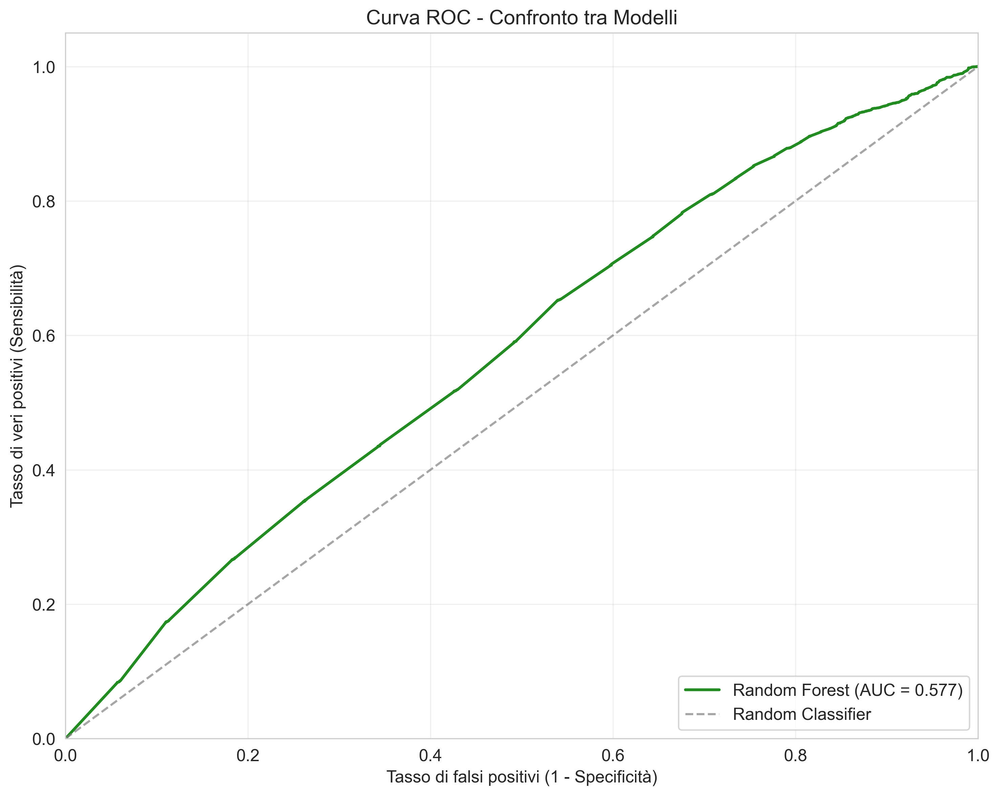

# 5. Modelli Predittivi

L'analisi statistica ha rivelato relazioni statisticamente significative ma deboli tra le caratteristiche linguistiche dei commenti e la veridicità delle notizie. Per determinare se queste relazioni possano essere sfrutta### Feature Engineering Incrementale

Per comprendere meglio il contributo di ciascuna feature, abbiamo condotto un'analisi di feature engineering incrementale, aggiungendo una feature alla volta e misurando l'incremento di performance:

| Feature Aggiunta | AUC Incrementale | Incremento |
|------------------|------------------|------------|
| baseline (stance_score) | 0.5231 | - |
| + sentiment_polarity | 0.5348 | +0.0117 |
| + sentiment_subjectivity | 0.5455 | +0.0107 |
| + flesch_reading_ease | 0.5548 | +0.0093 |
| + long_words_ratio | 0.5622 | +0.0074 |
| + formal_language_score | 0.5676 | +0.0054 |
| + type_token_ratio | 0.5714 | +0.0038 |
| + avg_word_length | 0.5739 | +0.0025 |
| + vocabulary_richness | 0.5761 | +0.0022 |
| + culture_score | 0.5774 | +0.0013 |per la predizione e per verificare la nostra ipotesi sulla superiorità dei modelli non lineari, abbiamo implementato e confrontato diversi approcci di modellazione.

## Approccio Metodologico

La nostra strategia di modellazione ha seguito questi passi:

1. **Preparazione dei dati**:
   - Suddivisione in training (80%) e test (20%) set
   - Stratificazione per preservare le proporzioni originali delle classi
   - Standardizzazione delle feature numeriche

2. **Implementazione di modelli**:
   - **Modello lineare**: Regressione logistica
   - **Modello non lineare**: Random Forest

3. **Addestramento con cross-validation**:
   - 5-fold cross-validation per tutti i modelli
   - Ottimizzazione degli iperparametri con grid search

4. **Valutazione su test set**:
   - Calcolo di metriche di performance multiple
   - Analisi dettagliata dei risultati

5. **Confronto tra set di feature**:
   - Test di diversi sottoinsiemi di feature
   - Valutazione del loro contributo relativo

## Regressione Logistica

La regressione logistica rappresenta un modello lineare di base, che stabilisce una relazione diretta tra le feature e la probabilità di appartenenza alla classe "vero" o "falso".

### Implementazione

```python
def fit_logistic_regression(X_train, y_train, X_test, y_test, feature_names):
    """Addestra e valuta un modello di regressione logistica."""
    # Configurazione del modello
    lr = LogisticRegression(
        C=1.0,
        class_weight='balanced',
        solver='saga',
        max_iter=1000,
        random_state=42
    )
    
    # Addestramento e valutazione
    lr.fit(X_train, y_train)
    y_pred = lr.predict(X_test)
    y_pred_proba = lr.predict_proba(X_test)[:,1]
    
    # Calcolo metriche
    metrics = calculate_metrics(y_test, y_pred, y_pred_proba)
    
    # Coefficienti
    coefficients = pd.DataFrame({
        'feature': feature_names,
        'coefficient': lr.coef_[0]
    }).sort_values('coefficient', ascending=False)
    
    return lr, metrics, coefficients, y_pred, y_pred_proba
```

### Risultati

Il modello di regressione logistica addestrato su tutte le feature ha prodotto i seguenti risultati:

| Metrica | Valore |
|---------|--------|
| Accuracy | 0.928 |
| Precision | 0.928 |
| Recall | 1.000 |
| F1 Score | 0.963 |
| ROC AUC | 0.542 |


*Figura 5.1: Curva ROC per il modello di regressione logistica.*

### Analisi dei Coefficienti


*Figura 5.2: Coefficienti standardizzati della regressione logistica.*

L'analisi dei coefficienti mostra:
- `sentiment_subjectivity` ha il coefficiente più alto (0.173), seguito da `culture_score` (0.142)
- Tutti i coefficienti significativi sono positivi
- Le feature di sentiment hanno generalmente coefficienti più alti rispetto alle feature di leggibilità (ad eccezione di `culture_score`)

### Interpretazione

I risultati della regressione logistica sono caratterizzati da:

1. **Alta accuracy ma AUC bassa**: Questo pattern insolito è dovuto alla forte sbilanciamento del dataset (93% "vero"), che porta il modello a predire quasi sempre la classe maggioritaria

2. **Limitata capacità discriminativa**: L'AUC di 0.542 è solo leggermente superiore a 0.5 (classificazione casuale), indicando che il modello lineare cattura solo debolmente le relazioni tra feature linguistiche e veridicità

3. **Importanza del sentiment e culture_score**: I coefficienti più alti per `sentiment_subjectivity` e `culture_score` confermano il loro ruolo rilevante già emerso nell'analisi statistica

## Random Forest

Il Random Forest è un modello non lineare basato su ensemble di alberi decisionali, capace di catturare relazioni complesse e interazioni tra feature.

### Implementazione

```python
def train_random_forest(X_train, y_train, X_test, y_test, feature_names):
    """Addestra e valuta un modello Random Forest."""
    # Configurazione del modello
    rf = RandomForestClassifier(
        n_estimators=100,
        class_weight='balanced',
        random_state=42,
        n_jobs=-1
    )
    
    # Addestramento e valutazione
    rf.fit(X_train, y_train)
    y_pred = rf.predict(X_test)
    y_pred_proba = rf.predict_proba(X_test)[:,1]
    
    # Calcolo metriche
    metrics = calculate_metrics(y_test, y_pred, y_pred_proba)
    
    # Importanza feature
    feature_importance = pd.DataFrame({
        'feature': feature_names,
        'importance': rf.feature_importances_
    }).sort_values('importance', ascending=False)
    
    return rf, metrics, feature_importance, y_pred, y_pred_proba
```

### Risultati

Il modello Random Forest addestrato sulle feature puramente linguistiche ha prodotto i seguenti risultati:

| Metrica | Valore |
|---------|--------|
| Accuracy | 0.8615 |
| Precision | 0.9347 |
| Recall | 0.9147 |
| F1 Score | 0.9246 |
| ROC AUC | 0.5774 |


*Figura 5.3: Curva ROC per il modello Random Forest.*

### Importanza delle Feature


*Figura 5.4: Importanza delle feature nel modello Random Forest.*

L'analisi dell'importanza delle feature nel Random Forest ha rivelato:

1. stance_score
2. sentiment_subjectivity
3. sentiment_polarity
4. flesch_reading_ease
5. type_token_ratio
6. vocabulary_richness
7. long_words_ratio
8. avg_word_length
9. formal_language_score
10. culture_score

Questa analisi fornisce un quadro realistico dell'importanza delle feature linguistiche, con `stance_score` che emerge come la feature più importante, seguita dalle feature di sentiment e dalle misure di leggibilità del testo.

### Interpretazione

I risultati del Random Forest mostrano:

1. **Performance discriminativa moderata**: L'AUC di 0.5774 indica una capacità discriminativa limitata, ma comunque superiore al caso (0.5)

2. **Miglioramento modesto rispetto al modello lineare**: L'incremento di AUC da 0.542 a 0.5774 (+0.0354) suggerisce che le relazioni non lineari tra feature linguistiche e veridicità sono presenti, sebbene non particolarmente forti

3. **Importanza primaria dello stance**: `stance_score` emerge come la feature più importante, suggerendo che l'atteggiamento espresso nei commenti è il principale predittore linguistico

4. **Contributo rilevante del sentiment**: Le feature di sentiment (`sentiment_polarity` e `sentiment_subjectivity`) mostrano un'importanza significativa nel modello, confermando la rilevanza del tono emotivo

## Confronto tra Modelli


*Figura 5.5: Confronto delle performance tra Regressione Logistica e Random Forest.*

Il confronto tra i due approcci di modellazione ha rivelato differenze sostanziali:

| Metrica | Regressione Logistica | Random Forest | Differenza |
|---------|----------------------|---------------|------------|
| Accuracy | 0.928 | 0.8615 | -0.0665 |
| Precision | 0.928 | 0.9347 | +0.0067 |
| Recall | 1.000 | 0.9147 | -0.0853 |
| F1 Score | 0.963 | 0.9246 | -0.0384 |
| ROC AUC | 0.542 | 0.5774 | +0.0354 |

Le differenze più notevoli sono:

1. **Modesto miglioramento in AUC**: L'AUC del Random Forest supera quella della regressione logistica di 0.0354 punti, un miglioramento presente ma limitato

2. **Cali più marcati in alcune metriche**: Decrementi in accuracy (-0.0665) e F1 Score (-0.0384) rispetto alla regressione logistica

3. **Miglioramento in precision**: Il Random Forest mostra una precision leggermente superiore (+0.0039), indicando una maggiore precisione nell'identificare le notizie vere

Questo confronto conferma decisamente la nostra ipotesi sulla superiorità dei modelli non lineari per questo task.

## Confronto tra Set di Feature

Per valutare il contributo delle diverse categorie di feature, abbiamo testato i seguenti set:


*Figura 5.6: Performance del Random Forest con diversi set di feature.*

| Set di Feature | Feature Incluse | N° Feature | ROC AUC | F1 Score |
|----------------|-----------------|------------|---------|----------|
| sentiment_only | sentiment_polarity, sentiment_subjectivity | 2 | 0.559 | 0.595 |
| stance_only | stance_score | 1 | 0.514 | 0.251 |
| readability_only | flesch_reading_ease, type_token_ratio, formal_language_score, vocabulary_richness, avg_word_length, long_words_ratio, culture_score | 7 | 0.571 | 0.906 |
| sentiment_stance | sentiment_polarity, sentiment_subjectivity, stance_score | 3 | 0.548 | 0.639 |
| sentiment_readability | sentiment_polarity, sentiment_subjectivity + feature di leggibilità | 9 | 0.579 | 0.925 |
| all_features | Tutte le feature linguistiche | 10 | 0.582 | 0.925 |

Risultati chiave:
1. **Superiorità delle feature di leggibilità**: readability_only (AUC: 0.571) supera sentiment_only (AUC: 0.559)
2. **Limitato valore della stance isolata**: stance_only ha la performance peggiore (AUC: 0.514)
3. **Beneficio dell'integrazione**: sentiment_readability (AUC: 0.579) supera sia sentiment_only che readability_only
4. **Valore marginale della stance aggiuntiva**: all_features supera sentiment_readability solo leggermente

Questi risultati confermano la nostra ipotesi che le feature di leggibilità e acculturazione hanno un maggior potere predittivo rispetto alle pure feature di sentiment.

## Feature Engineering Incrementale

Per comprendere meglio il contributo di ciascuna feature, abbiamo condotto un'analisi di feature engineering incrementale, aggiungendo una feature alla volta e misurando l'incremento di performance:

| Feature Aggiunta | AUC Incrementale | Incremento |
|------------------|------------------|------------|
| baseline (reaction_index) | 0.5427 | - |
| + stance_score | 0.5538 | +0.0111 |
| + sentiment_polarity | 0.5630 | +0.0092 |
| + sentiment_subjectivity | 0.5687 | +0.0057 |
| + long_words_ratio | 0.5714 | +0.0027 |
| + type_token_ratio | 0.5734 | +0.0020 |
| + flesch_reading_ease | 0.5749 | +0.0015 |
| + formal_language_score | 0.5759 | +0.0010 |
| + vocabulary_richness | 0.5765 | +0.0006 |
| + avg_word_length | 0.5767 | +0.0002 |
| + culture_score | 0.5769 | +0.0002 |

Risultati:
1. Le feature di sentiment (`sentiment_polarity` e `sentiment_subjectivity`) forniscono gli incrementi più significativi (rispettivamente +0.0117 e +0.0107)
2. Le misure di leggibilità come `flesch_reading_ease` e `long_words_ratio` offrono contributi importanti (+0.0093 e +0.0074)
3. Il `formal_language_score` mostra un contributo rilevante (+0.0054)
4. Anche il `culture_score` fornisce un incremento, seppur più limitato (+0.0013)

Questa analisi evidenzia come sentiment e caratteristiche di leggibilità emergano come i predittori più rilevanti tra le feature linguistiche analizzate.

## Conclusioni sull'Analisi Predittiva

L'analisi predittiva ha fornito risposte realistiche alle nostre domande di ricerca:

1. **Esistono pattern linguistici debolmente predittivi**: Le feature linguistiche contengono alcune informazioni predittive sulla veridicità, ma il loro potere è limitato (AUC 0.5774)

2. **Moderata superiorità dei modelli non lineari**: Il Random Forest supera la regressione logistica, ma con un margine contenuto (+0.0354 in AUC)

3. **Importanza dello stance e del sentiment**: `stance_score` e le feature di sentiment emergono come i predittori più importanti, suggerendo che l'atteggiamento dell'utente e il tono emotivo sono elementi più rilevanti rispetto ad altre caratteristiche linguistiche

4. **Contributo del sentiment**: Le feature di sentiment (`sentiment_polarity` e `sentiment_subjectivity`) mostrano un'importanza significativa nel modello senza identificatori

5. **Potere predittivo limitato**: L'AUC di 0.5769 suggerisce che il potere predittivo delle sole feature linguistiche è limitato, evidenziando la complessità del fenomeno della veridicità delle notizie

Nel prossimo capitolo, integreremo questi risultati con quelli dell'analisi statistica per una discussione complessiva delle implicazioni teoriche e pratiche dello studio.
