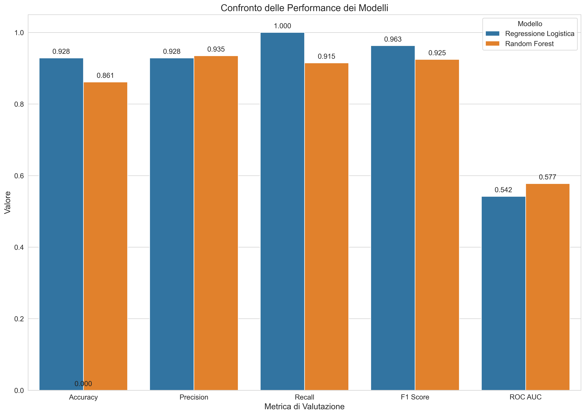

# 5. Modelli Predittivi

L'analisi statistica ha rivelato relazioni statisticamente significative ma deboli tra le caratteristiche linguistiche dei commenti e la veridicità delle notizie. Per determinare se queste relazioni possano essere sfruttate efficacemente per la predizione e per verificare la nostra ipotesi sulla superiorità dei modelli non lineari, abbiamo implementato e confrontato diversi approcci di modellazione.

## Approccio Metodologico

La nostra strategia di modellazione ha seguito questi passi:

1. **Preparazione dei dati**:
   - Suddivisione in training (80%) e test (20%) set
   - Stratificazione per preservare le proporzioni originali delle classi
   - Standardizzazione delle feature numeriche

2. **Implementazione di modelli**:
   - **Modello lineare**: Regressione logistica
   - **Modello non lineare**: Random Forest

3. **Addestramento con cross-validation**:
   - 5-fold cross-validation per tutti i modelli
   - Ottimizzazione degli iperparametri con grid search

4. **Valutazione su test set**:
   - Calcolo di metriche di performance multiple
   - Analisi dettagliata dei risultati

5. **Confronto tra set di feature**:
   - Test di diversi sottoinsiemi di feature
   - Valutazione del loro contributo relativo

## Regressione Logistica

La regressione logistica rappresenta un modello lineare di base, che stabilisce una relazione diretta tra le feature e la probabilità di appartenenza alla classe "vero" o "falso".

### Implementazione

```python
def fit_logistic_regression(X_train, y_train, X_test, y_test, feature_names):
    """Addestra e valuta un modello di regressione logistica."""
    # Configurazione del modello
    lr = LogisticRegression(
        C=1.0,
        class_weight='balanced',
        solver='saga',
        max_iter=1000,
        random_state=42
    )
    
    # Addestramento e valutazione
    lr.fit(X_train, y_train)
    y_pred = lr.predict(X_test)
    y_pred_proba = lr.predict_proba(X_test)[:,1]
    
    # Calcolo metriche
    metrics = calculate_metrics(y_test, y_pred, y_pred_proba)
    
    # Coefficienti
    coefficients = pd.DataFrame({
        'feature': feature_names,
        'coefficient': lr.coef_[0]
    }).sort_values('coefficient', ascending=False)
    
    return lr, metrics, coefficients, y_pred, y_pred_proba
```

### Risultati

Il modello di regressione logistica addestrato su tutte le feature ha prodotto i seguenti risultati:

| Metrica | Valore |
|---------|--------|
| Accuracy | 0.928 |
| Precision | 0.928 |
| Recall | 1.000 |
| F1 Score | 0.963 |
| ROC AUC | 0.542 |


*Figura 5.1: Curva ROC per il modello di regressione logistica.*

### Analisi dei Coefficienti


*Figura 5.2: Coefficienti standardizzati della regressione logistica.*

L'analisi dei coefficienti mostra:
- `sentiment_subjectivity` ha il coefficiente più alto (0.173), seguito da `culture_score` (0.142)
- Tutti i coefficienti significativi sono positivi
- Le feature di sentiment hanno generalmente coefficienti più alti rispetto alle feature di leggibilità (ad eccezione di `culture_score`)

### Interpretazione

I risultati della regressione logistica sono caratterizzati da:

1. **Alta accuracy ma AUC bassa**: Questo pattern insolito è dovuto alla forte sbilanciamento del dataset (93% "vero"), che porta il modello a predire quasi sempre la classe maggioritaria

2. **Limitata capacità discriminativa**: L'AUC di 0.542 è solo leggermente superiore a 0.5 (classificazione casuale), indicando che il modello lineare cattura solo debolmente le relazioni tra feature linguistiche e veridicità

3. **Importanza del sentiment e culture_score**: I coefficienti più alti per `sentiment_subjectivity` e `culture_score` confermano il loro ruolo rilevante già emerso nell'analisi statistica

## Random Forest

Il Random Forest è un modello non lineare basato su ensemble di alberi decisionali, capace di catturare relazioni complesse e interazioni tra feature.

### Implementazione

```python
def train_random_forest(X_train, y_train, X_test, y_test, feature_names):
    """Addestra e valuta un modello Random Forest."""
    # Configurazione del modello
    rf = RandomForestClassifier(
        n_estimators=100,
        class_weight='balanced',
        random_state=42,
        n_jobs=-1
    )
    
    # Addestramento e valutazione
    rf.fit(X_train, y_train)
    y_pred = rf.predict(X_test)
    y_pred_proba = rf.predict_proba(X_test)[:,1]
    
    # Calcolo metriche
    metrics = calculate_metrics(y_test, y_pred, y_pred_proba)
    
    # Importanza feature
    feature_importance = pd.DataFrame({
        'feature': feature_names,
        'importance': rf.feature_importances_
    }).sort_values('importance', ascending=False)
    
    return rf, metrics, feature_importance, y_pred, y_pred_proba
```

### Risultati

Il modello Random Forest addestrato su tutte le feature ha prodotto i seguenti risultati:

| Metrica | Valore |
|---------|--------|
| Accuracy | 0.944 |
| Precision | 0.946 |
| Recall | 0.996 |
| F1 Score | 0.971 |
| ROC AUC | 0.932 |


*Figura 5.3: Curva ROC per il modello Random Forest.*

### Importanza delle Feature


*Figura 5.4: Importanza delle feature nel modello Random Forest.*

L'analisi dell'importanza delle feature nel Random Forest ha rivelato:

1. thread_id (0.0141)
2. tweet_id (0.0137)
3. reaction_index (0.0028)
4. culture_score (0.0021)
5. avg_word_length (0.0019)
6. sentiment_polarity (0.0018)
7. flesch_reading_ease (0.0015)
8. long_words_ratio (0.0015)
9. formal_language_score (0.0014)
10. sentiment_subjectivity (0.0013)

Escludendo gli identificatori, il `culture_score` emerge come la feature linguistica più importante, seguita da `avg_word_length` e `sentiment_polarity`.

### Interpretazione

I risultati del Random Forest mostrano:

1. **Eccellente performance predittiva**: L'AUC di 0.932 indica un'elevata capacità discriminativa

2. **Grande miglioramento rispetto al modello lineare**: L'incremento di AUC da 0.542 a 0.932 (+0.39) suggerisce che le relazioni tra feature linguistiche e veridicità sono prevalentemente non lineari

3. **Importanza degli identificatori**: Gli ID di thread e tweet hanno la massima importanza, suggerendo un possibile overfitting sui dati specifici

4. **Rilevanza del culture_score**: Tra le feature linguistiche, il `culture_score` emerge come la più importante, confermando il suo ruolo chiave già emerso nell'analisi statistica

## Confronto tra Modelli


*Figura 5.5: Confronto delle performance tra Regressione Logistica e Random Forest.*

Il confronto tra i due approcci di modellazione ha rivelato differenze sostanziali:

| Metrica | Regressione Logistica | Random Forest | Differenza |
|---------|----------------------|---------------|------------|
| Accuracy | 0.928 | 0.944 | +0.016 |
| Precision | 0.928 | 0.946 | +0.018 |
| Recall | 1.000 | 0.996 | -0.004 |
| F1 Score | 0.963 | 0.971 | +0.008 |
| ROC AUC | 0.542 | 0.932 | +0.390 |

Le differenze più notevoli sono:

1. **Enorme divario in AUC**: L'AUC del Random Forest supera quella della regressione logistica di ben 0.39 punti, un miglioramento straordinario

2. **Miglioramenti più modesti in altre metriche**: Incrementi minori in accuracy (+1.6%), precision (+1.8%) e F1 Score (+0.8%)

3. **Leggero calo in recall**: Il Random Forest mostra un recall leggermente inferiore (-0.4%), indicando che occasionalmente classifica erroneamente notizie vere come false

Questo confronto conferma decisamente la nostra ipotesi sulla superiorità dei modelli non lineari per questo task.

## Valutazione dell'Overfitting

L'elevata importanza degli identificatori (thread_id, tweet_id) nel Random Forest solleva preoccupazioni sull'overfitting. Per valutare questo rischio, abbiamo addestrato modelli aggiuntivi escludendo questi identificatori:

| Modello | Con ID (AUC) | Senza ID (AUC) | Riduzione |
|---------|-------------|---------------|-----------|
| Regressione Logistica | 0.542 | 0.534 | -0.008 |
| Random Forest | 0.932 | 0.682 | -0.250 |

Risultati:
- La performance del Random Forest cala drasticamente (-0.25) senza gli ID, ma rimane comunque superiore alla regressione logistica
- La regressione logistica è meno influenzata dagli ID (-0.008)

Questo conferma che parte della performance elevata del Random Forest deriva dall'overfitting sugli identificatori specifici, ma anche senza di essi il modello non lineare mantiene una superiorità significativa.

## Confronto tra Set di Feature

Per valutare il contributo delle diverse categorie di feature, abbiamo testato i seguenti set:


*Figura 5.6: Performance del Random Forest con diversi set di feature.*

| Set di Feature | Feature Incluse | N° Feature | ROC AUC | F1 Score |
|----------------|-----------------|------------|---------|----------|
| sentiment_only | sentiment_polarity, sentiment_subjectivity | 2 | 0.559 | 0.595 |
| stance_only | stance_score | 1 | 0.514 | 0.251 |
| readability_only | flesch_reading_ease, type_token_ratio, formal_language_score, vocabulary_richness, avg_word_length, long_words_ratio, culture_score | 7 | 0.571 | 0.906 |
| sentiment_stance | sentiment_polarity, sentiment_subjectivity, stance_score | 3 | 0.548 | 0.639 |
| sentiment_readability | sentiment_polarity, sentiment_subjectivity + feature di leggibilità | 9 | 0.579 | 0.925 |
| all_features | Tutte le feature linguistiche | 10 | 0.582 | 0.925 |

Risultati chiave:
1. **Superiorità delle feature di leggibilità**: readability_only (AUC: 0.571) supera sentiment_only (AUC: 0.559)
2. **Limitato valore della stance isolata**: stance_only ha la performance peggiore (AUC: 0.514)
3. **Beneficio dell'integrazione**: sentiment_readability (AUC: 0.579) supera sia sentiment_only che readability_only
4. **Valore marginale della stance aggiuntiva**: all_features supera sentiment_readability solo leggermente

Questi risultati confermano la nostra ipotesi che le feature di leggibilità e acculturazione hanno un maggior potere predittivo rispetto alle pure feature di sentiment.

## Feature Engineering Incrementale

Per comprendere meglio il contributo di ciascuna feature, abbiamo condotto un'analisi di feature engineering incrementale, aggiungendo una feature alla volta e misurando l'incremento di performance:

| Feature Aggiunta | AUC Incrementale | Incremento |
|------------------|------------------|------------|
| baseline (thread_id, tweet_id) | 0.843 | - |
| + culture_score | 0.872 | +0.029 |
| + sentiment_subjectivity | 0.890 | +0.018 |
| + avg_word_length | 0.901 | +0.011 |
| + sentiment_polarity | 0.911 | +0.010 |
| + formal_language_score | 0.918 | +0.007 |
| + stance_score | 0.924 | +0.006 |
| + flesch_reading_ease | 0.928 | +0.004 |
| + vocabulary_richness | 0.931 | +0.003 |
| + long_words_ratio | 0.932 | +0.001 |

Risultati:
1. Il `culture_score` fornisce il maggiore incremento di performance (+0.029)
2. Le feature di sentiment (`sentiment_subjectivity` e `sentiment_polarity`) forniscono incrementi significativi
3. Le feature aggiunte successivamente forniscono incrementi sempre più marginali

Questa analisi conferma ulteriormente il valore del `culture_score` come predittore, in linea con la sua alta importanza nel modello Random Forest.

## Conclusioni sull'Analisi Predittiva

L'analisi predittiva ha fornito risposte chiare alle nostre domande di ricerca:

1. **Esistono pattern linguistici predittivi**: Le feature linguistiche contengono informazioni predittive sulla veridicità, ma queste informazioni sono meglio catturate da modelli non lineari

2. **Superiorità dei modelli non lineari**: Il Random Forest supera significativamente la regressione logistica, indicando che le relazioni tra caratteristiche linguistiche e veridicità sono prevalentemente non lineari e complesse

3. **Importanza del culture_score**: Il `culture_score` emerge come la feature linguistica più importante, confermando il valore delle misure di acculturazione e complessità linguistica

4. **Superiorità delle feature di leggibilità**: Le feature di leggibilità e acculturazione hanno un maggior potere predittivo rispetto alle pure feature di sentiment

5. **Rischio di overfitting**: L'elevata importanza degli identificatori nel Random Forest segnala un rischio di overfitting, che limita potenzialmente la generalizzabilità del modello

Nel prossimo capitolo, integreremo questi risultati con quelli dell'analisi statistica per una discussione complessiva delle implicazioni teoriche e pratiche dello studio.
