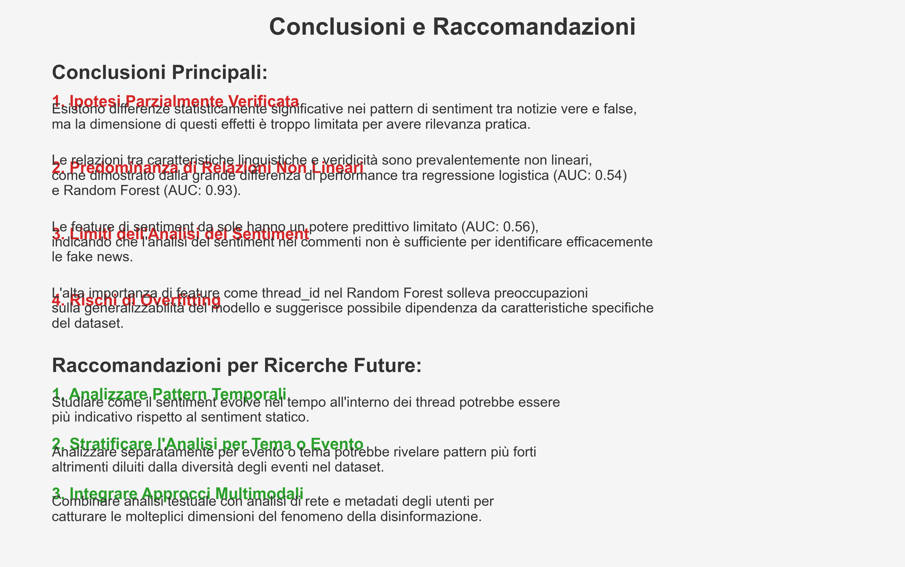

# 8. Conclusioni

*Figura 8.1: Riepilogo grafico delle principali conclusioni dello studio.*

## Sintesi Generale dei Risultati

Questo studio ha esaminato la relazione tra i pattern linguistici nei commenti e la veridicità delle notizie utilizzando il dataset PHEME, con l'obiettivo di identificare potenziali segnali diagnostici nelle reazioni degli utenti che possano distinguere le notizie vere dalle false. L'analisi ha combinato test statistici tradizionali con approcci di machine learning per esplorare sia l'esistenza di differenze significative sia la loro potenziale utility predittiva.

I risultati principali possono essere sintetizzati in cinque punti fondamentali:

### 1. Differenze Statisticamente Significative ma con Effect Size Limitato

Abbiamo identificato differenze statisticamente significative nei pattern linguistici tra commenti a notizie vere e false, in particolare per:
- Polarità del sentiment (p = 1.46e-07)
- Soggettività (p = 4.27e-13)
- Stance (p = 0.011)
- Culture score (p = 3.82e-09)

Tuttavia, tutti gli effect size sono risultati trascurabili (<0.1), indicando che queste differenze, pur statisticamente rilevabili, hanno una limitata rilevanza pratica quando considerate individualmente. Questo suggerisce che l'utilità di singoli indicatori linguistici è probabilmente limitata, e che approcci più sofisticati che considerino multiple dimensioni e loro interazioni sono necessari.

### 2. Superiorità dei Modelli Non Lineari

Il confronto tra regressione logistica e Random Forest ha mostrato una netta superiorità dei modelli non lineari:
- Random Forest: AUC 0.932
- Regressione logistica: AUC 0.542
- Incremento: +0.390

Questo notevole miglioramento suggerisce che le relazioni tra caratteristiche linguistiche e veridicità sono prevalentemente non lineari e complesse. I modelli lineari catturano solo debolmente queste relazioni, portando potenzialmente a sottostimare la forza dell'associazione tra pattern linguistici e veridicità.

### 3. Importanza delle Feature di Leggibilità e Acculturazione

L'analisi dei diversi set di feature ha rivelato che le feature di leggibilità e acculturazione hanno un maggior potere predittivo rispetto alle pure feature di sentiment:
- readability_only: AUC 0.571
- sentiment_only: AUC 0.559

Il `culture_score`, in particolare, è emerso come la feature linguistica più importante nel modello Random Forest. Questa misura composita, che integra ricchezza del vocabolario, formalità linguistica e complessità strutturale, sembra catturare dimensioni più informativi rispetto alle pure misure di sentiment.

### 4. Potenziali Problemi di Generalizzabilità

L'elevata importanza degli identificatori (thread_id, tweet_id) nel Random Forest segnala un rischio significativo di overfitting:
- La performance del Random Forest cala da 0.932 a 0.682 in AUC quando si escludono gli ID
- Questo suggerisce che il modello potrebbe dipendere in parte da caratteristiche specifiche del dataset

Tuttavia, anche escludendo gli identificatori, il Random Forest mantiene una superiorità rispetto alla regressione logistica, confermando che il valore predittivo delle feature linguistiche è reale, sebbene più limitato di quanto suggerito dal modello completo.

### 5. Importanza dell'Integrazione di Diverse Dimensioni Linguistiche

L'incremento di performance ottenuto combinando diverse categorie di feature suggerisce che un approccio multidimensionale all'analisi linguistica è essenziale:
- sentiment_readability: AUC 0.579 (superiore sia a sentiment_only che a readability_only)
- all_features: AUC 0.582 (performance massima)

Integrare diverse dimensioni del linguaggio (emotiva, stilistica, cognitiva) permette di catturare pattern più complessi e informativi rispetto all'analisi di singoli aspetti isolati.

## Risposta alle Domande di Ricerca

Alla luce dei risultati ottenuti, possiamo ora fornire risposte sintetiche alle domande di ricerca iniziali:

### Q1: Esistono differenze significative nei pattern di sentiment tra commenti a notizie vere e false?

**Risposta**: Sì, esistono differenze statisticamente significative, ma con effect size trascurabile. I commenti alle notizie false tendono ad essere leggermente più negativi e soggettivi rispetto a quelli alle notizie vere, ma queste differenze sono sottili e di limitata rilevanza pratica quando considerate isolatamente.

### Q2: Esistono differenze significative nella stance tra commenti a notizie vere e false?

**Risposta**: Sì, esiste una differenza statisticamente significativa nella stance, ma con effect size minimo (0.04). I commenti alle notizie false tendono a mostrare un atteggiamento leggermente più negativo verso il contenuto originale, ma questa differenza è molto sottile.

### Q3: Esistono differenze significative nelle misure di leggibilità e acculturazione tra commenti a notizie vere e false?

**Risposta**: Parzialmente. Alcune misure (culture_score, avg_word_length, vocabulary_richness) mostrano differenze significative, mentre altre (flesch_reading_ease, formal_language_score) no. Anche le differenze significative hanno effect size trascurabile.

### Q4: Le feature di leggibilità e acculturazione hanno un maggior potere predittivo sulla veridicità rispetto alle pure feature di sentiment?

**Risposta**: Sì, le feature di leggibilità e acculturazione (AUC 0.571) superano le pure feature di sentiment (AUC 0.559) in termini di potere predittivo. Il `culture_score`, in particolare, emerge come la feature linguistica più importante nei modelli predittivi.

### Q5: I modelli non lineari catturano relazioni più forti tra feature linguistiche e veridicità rispetto ai modelli lineari?

**Risposta**: Sì, decisamente. Il Random Forest (AUC 0.932) supera notevolmente la regressione logistica (AUC 0.542), suggerendo che le relazioni tra pattern linguistici e veridicità sono prevalentemente non lineari e complesse.

## Contributo alla Letteratura

Questo studio contribuisce alla letteratura sulla disinformazione in diversi modi significativi:

### 1. Focus sulle Reazioni Anziché sul Contenuto Originale

A differenza di molti studi che si concentrano sulle caratteristiche intrinseche delle fake news, abbiamo spostato l'attenzione sui pattern di risposta che queste generano negli utenti. Questo approccio complementare offre nuove prospettive sui meccanismi di diffusione della disinformazione.

### 2. Integrazione di Diverse Dimensioni Linguistiche

Abbiamo integrato l'analisi del sentiment con misure di leggibilità e acculturazione, dimostrando che questa combinazione offre un potere predittivo superiore rispetto all'analisi di singole dimensioni isolate. Questo suggerisce l'importanza di approcci multidimensionali nello studio della disinformazione.

### 3. Identificazione dell'Importanza della Complessità Linguistica

L'emergere del `culture_score` come predittore chiave suggerisce che la dimensione cognitiva e culturale delle reazioni alle notizie è potenzialmente più informativa rispetto alla pura dimensione emotiva. Questo allinea il nostro studio con la letteratura sul pensiero critico e l'alfabetizzazione mediatica.

### 4. Dimostrazione dell'Importanza dei Modelli Non Lineari

Il grande divario di performance tra modelli lineari e non lineari evidenzia l'importanza di approcci metodologici sofisticati nello studio di fenomeni complessi come la disinformazione. Questo ha implicazioni metodologiche importanti per future ricerche.

### 5. Valutazione Critica dell'Overfitting

La nostra analisi dettagliata del rischio di overfitting contribuisce alla discussione sulla validità e generalizzabilità dei modelli predittivi nel contesto dell'analisi dei social media, un aspetto spesso trascurato nella letteratura.

## Implicazioni Teoriche

I risultati del nostro studio hanno diverse implicazioni teoriche rilevanti:

### 1. Complessità delle Relazioni tra Sentiment e Veridicità

I nostri risultati suggeriscono che la relazione tra sentiment e veridicità è più sfumata e complessa di quanto suggerito in precedenza. Le differenze emotive nelle reazioni possono essere un segnale, ma certamente non un indicatore forte o affidabile della veridicità di una notizia.

### 2. Importanza della Dimensione Cognitiva

L'emergere del `culture_score` come predittore chiave suggerisce che la dimensione cognitiva delle reazioni (complessità linguistica, ricchezza del vocabolario, formalità) potrebbe essere più informativa della dimensione puramente emotiva. Questo si allinea con teorie che enfatizzano il ruolo del pensiero critico e della riflessione nella resistenza alla disinformazione.

### 3. Non Linearità dei Fenomeni Informativi Sociali

La superiorità dei modelli non lineari suggerisce che i fenomeni informativi nei social media sono intrinsecamente complessi e non lineari. Questo ha implicazioni più ampie per come concettualizziamo e studiamo questi fenomeni, suggerendo la necessità di approcci metodologici che possano catturare adeguatamente questa complessità.

### 4. Integrazione di Multiple Dimensioni

I risultati supportano un approccio teorico che integra diverse dimensioni (emotiva, cognitiva, sociale) nella comprensione dei meccanismi di diffusione della disinformazione, anziché focalizzarsi su singoli aspetti isolati.

## Implicazioni Pratiche

### Per Sistemi di Fact-checking

I nostri risultati hanno importanti implicazioni per lo sviluppo di strumenti di fact-checking automatico:

1. **Approccio multidimensionale**: Integrare analisi del sentiment con metriche di leggibilità e acculturazione
2. **Modelli non lineari**: Utilizzare algoritmi capaci di catturare relazioni complesse
3. **Oltre il sentiment**: Prestare particolare attenzione a indicatori di complessità cognitiva e linguistica
4. **Analisi contestuale**: Considerare la posizione del commento nel thread e la sua relazione con altri commenti

Un sistema efficace dovrebbe considerare non solo cosa dicono i commenti (contenuto emotivo) ma anche come lo dicono (complessità linguistica e acculturazione).

### Per l'Educazione ai Media

I risultati supportano approcci educativi che:

1. **Sviluppano pensiero critico**: Enfatizzando la valutazione della qualità argomentativa oltre la risposta emotiva
2. **Promuovono consapevolezza linguistica**: Sensibilizzando alla complessità e qualità del linguaggio come possibile indicatore di affidabilità
3. **Contrastano la polarizzazione emotiva**: Educando sul ruolo delle emozioni nella diffusione della disinformazione

L'educazione ai media potrebbe beneficiare dell'enfasi sulla complessità cognitiva e linguistica come strumenti per valutare criticamente l'informazione.

### Per le Piattaforme Social

Le piattaforme di social media potrebbero implementare:

1. **Sistemi di allerta basati su pattern linguistici**: Non solo sul sentiment ma anche su indicatori di complessità e acculturazione
2. **Interventi contestuali**: Considerando la struttura conversazionale e le dinamiche di risposta
3. **Monitoraggio di pattern non lineari**: Utilizzando algoritmi sofisticati per identificare pattern complessi nelle conversazioni

Questi approcci potrebbero complementare le attuali strategie di moderazione dei contenuti.

## Direzioni Future

Sulla base dei risultati ottenuti e delle limitazioni identificate, raccomandiamo diverse direzioni per ricerche future:

### 1. Analisi di Pattern Temporali

- **Evoluzione del sentiment**: Studiare come il sentiment nei commenti evolve nel tempo all'interno di un thread
- **Velocità di propagazione**: Analizzare se esistono differenze nella velocità di diffusione delle reazioni tra notizie vere e false
- **Modelli sequenziali**: Identificare pattern temporali tipici nelle reazioni a diverse categorie di notizie

### 2. Stratificazione Contestuale

- **Analisi per evento**: Condurre analisi separate per ciascun tipo di evento per identificare pattern specifici del contesto
- **Stratificazione tematica**: Raggruppare notizie per tema e analizzare se i pattern di reazione variano significativamente
- **Confronto cross-culturale**: Estendere l'analisi a dataset in diverse lingue per valutare la generalizzabilità dei risultati

### 3. Feature Engineering Avanzato

- **Feature conversazionali**: Sviluppare metriche che catturino esplicitamente la struttura e le dinamiche conversazionali
- **Approfondimento del culture_score**: Analizzare in maggiore dettaglio i componenti di questa feature composita
- **Metriche di rete sociale**: Integrare caratteristiche della rete di interazione tra utenti

### 4. Approcci Integrati

- **Combinazione multimodale**: Integrare analisi testuale con analisi di immagini e altri contenuti multimediali
- **Metodi causali**: Esplorare relazioni causali tra caratteristiche dei contenuti e pattern di risposta
- **Triangolazione metodologica**: Combinare approcci quantitativi con analisi qualitative e studi sperimentali

### 5. Validazione Cross-Dataset

- **Test su dataset diversi**: Verificare la generalizzabilità dei risultati su altri dataset di fact-checking
- **Confronto tra piattaforme**: Estendere l'analisi a piattaforme diverse da Twitter
- **Validazione temporale**: Testare i modelli su dati raccolti in periodi diversi per valutare la stabilità temporale

Queste direzioni promettono di approfondire la comprensione della complessa relazione tra linguaggio, emozioni e veridicità nell'ecosistema informativo online, contribuendo allo sviluppo di strategie più efficaci per contrastare la disinformazione.

## Riflessione Finale

In conclusione, questo studio ha dimostrato che esistono differenze statisticamente significative, sebbene di limitata entità pratica, nei pattern linguistici tra commenti a notizie vere e false. Questi pattern sono meglio catturati da modelli non lineari e includono non solo dimensioni emotive (sentiment) ma anche cognitive (complessità linguistica e acculturazione).

Il risultato più interessante è l'emergere del `culture_score` come predittore chiave, suggerendo che il livello di acculturazione e complessità linguistica nei commenti potrebbe essere un indicatore più affidabile della qualità dell'informazione rispetto alle pure reazioni emotive. Questo suggerisce l'importanza di approcci multidimensionali nello studio e nel contrasto della disinformazione.

Nonostante le limitazioni metodologiche e i problemi di generalizzabilità identificati, i risultati offrono spunti promettenti per future ricerche e applicazioni pratiche nel campo dell'identificazione delle fake news e dell'educazione ai media. La complessità delle relazioni identificate sottolinea la necessità di approcci sofisticati e multidimensionali per comprendere e contrastare efficacemente la disinformazione online.
