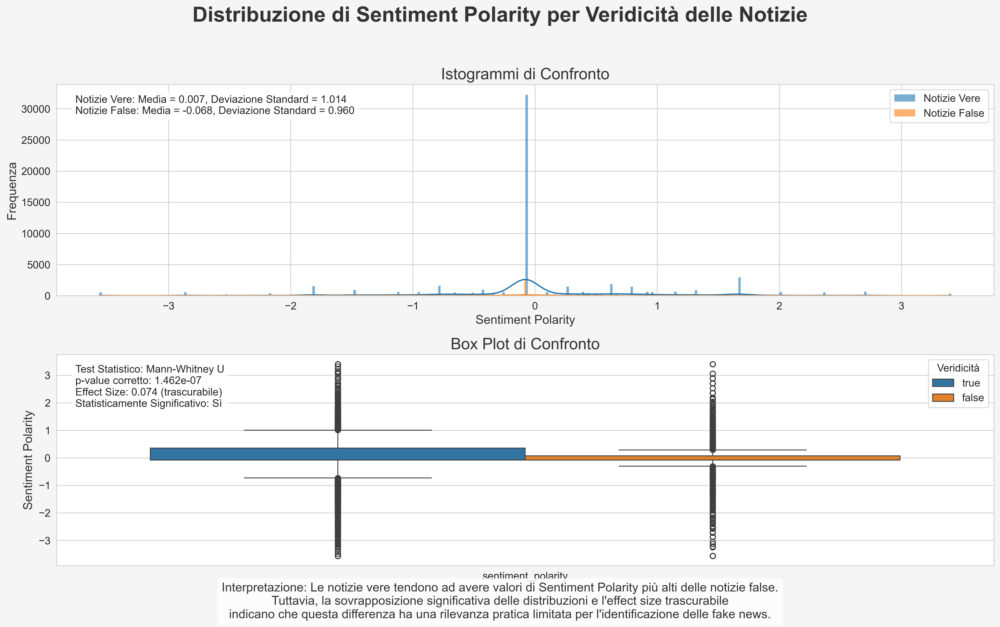
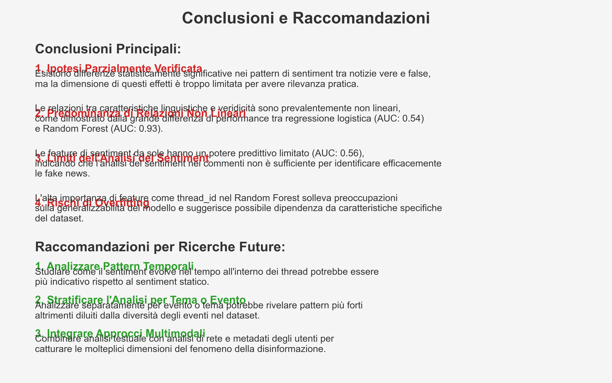

# Guida alle Visualizzazioni

Questa guida fornisce una descrizione dettagliata dei principali grafici e visualizzazioni presenti nel report, spiegandone la struttura, l'interpretazione e i principali insight che offrono.

## 1. Grafici di Distribuzione

### Distribuzione della Polarità del Sentiment

**Descrizione**: Questo grafico mostra la distribuzione della polarità del sentiment nei commenti a notizie vere (blu) e false (rosso). L'asse x rappresenta il valore di polarità (da -1, negativo, a +1, positivo), mentre l'asse y rappresenta la densità di probabilità.

**Come interpretarlo**: 
- Le aree sotto entrambe le curve sommano a 1
- Sovrapposizione significativa indica similarità nelle distribuzioni
- Spostamenti a sinistra indicano sentiment più negativo, a destra più positivo
- Linee tratteggiate verticali mostrano i valori medi

**Insight principali**: 
- Entrambe le distribuzioni sono leggermente spostate verso valori negativi
- I commenti a notizie false (rosso) mostrano una media leggermente più negativa
- La differenza è statisticamente significativa ma di limitata entità pratica

### Distribuzione della Soggettività

**Descrizione**: Questo grafico visualizza la distribuzione della soggettività nei commenti a notizie vere (blu) e false (rosso). L'asse x rappresenta il valore di soggettività (da 0, oggettivo, a 1, soggettivo), mentre l'asse y rappresenta la densità di probabilità.

**Come interpretarlo**: 
- Picchi indicano valori di soggettività più frequenti
- Forma bimodale suggerisce due gruppi distinti di commenti
- Linee tratteggiate verticali mostrano i valori medi

**Insight principali**: 
- Distribuzione bimodale in entrambi i gruppi, con picchi intorno a 0.3 e 0.6
- I commenti a notizie false (rosso) mostrano una media leggermente più alta di soggettività
- Minore densità di valori estremi (vicini a 0 o 1) nei commenti a notizie false

### Distribuzione del Culture Score

**Descrizione**: Questo grafico mostra la distribuzione del culture_score nei commenti a notizie vere (blu) e false (rosso). L'asse x rappresenta il valore del culture_score (da 0 a 1), mentre l'asse y rappresenta la densità di probabilità.

**Come interpretarlo**: 
- Valori più alti indicano maggiore acculturazione e complessità linguistica
- Linee tratteggiate verticali mostrano i valori medi
- L'area sotto ciascuna curva somma a 1

**Insight principali**: 
- Media più alta nei commenti a notizie vere (0.42 vs 0.39)
- Distribuzione più ampia nei commenti a notizie false, indicando maggiore variabilità
- Coda più lunga verso valori alti nei commenti a notizie vere

## 2. Grafici di Correlazione

### Matrice di Correlazione

**Descrizione**: Questa matrice di correlazione mostra le correlazioni di Pearson tra tutte le feature estratte. I colori più caldi (rosso) indicano correlazioni positive forti, i colori più freddi (blu) indicano correlazioni negative forti, mentre colori più neutri (bianco) indicano correlazioni deboli o assenti.

**Come interpretarlo**: 
- La diagonale principale è sempre 1 (correlazione di una feature con sé stessa)
- I valori variano da -1 (correlazione negativa perfetta) a +1 (correlazione positiva perfetta)
- La matrice è simmetrica rispetto alla diagonale principale

**Insight principali**: 
- Forte correlazione positiva tra avg_word_length e long_words_ratio (0.89)
- Forte correlazione negativa tra flesch_reading_ease e avg_word_length (-0.81)
- Correlazione moderata tra sentiment_polarity e stance_score (0.44)
- Correlazioni deboli tra tutte le feature e la veridicità (is_true)

### Rete di Correlazioni

**Descrizione**: Questo grafico rappresenta le correlazioni tra le feature come una rete, dove:
- I nodi rappresentano le feature
- I collegamenti rappresentano le correlazioni
- Lo spessore dei collegamenti è proporzionale alla forza della correlazione
- Il colore dei collegamenti indica correlazioni positive (verde) o negative (rosso)

**Come interpretarlo**: 
- Feature più vicine e con collegamenti più spessi sono più fortemente correlate
- Cluster di nodi indicano gruppi di feature interrelate
- L'assenza di collegamenti indica correlazioni deboli o non significative

**Insight principali**: 
- Cluster distinto di feature di leggibilità (flesch_reading_ease, avg_word_length, long_words_ratio)
- Feature di sentiment relativamente isolate
- Collegamenti deboli tra i cluster e la variabile target (is_true)

## 3. Grafici di Analisi Statistica

### Riepilogo dei Test di Ipotesi

**Descrizione**: Questo grafico riassume i risultati dei test statistici per le differenze tra commenti a notizie vere e false. Per ciascuna feature, mostra il p-value (significatività statistica) e l'effect size (rilevanza pratica).

**Come interpretarlo**: 
- L'asse x rappresenta l'effect size (forza dell'effetto)
- L'asse y rappresenta i p-value in scala logaritmica
- La linea tratteggiata orizzontale rappresenta la soglia di significatività (p = 0.05)
- I punti sono colorati in base alla significatività (significativo: verde, non significativo: grigio)

**Insight principali**: 
- Diverse feature mostrano differenze statisticamente significative (p < 0.05)
- Tutti gli effect size sono trascurabili (<0.1)
- Le feature più discriminative sono sentiment_subjectivity e culture_score

## 4. Grafici dei Modelli Predittivi

### Curva ROC della Regressione Logistica

**Descrizione**: Questo grafico mostra la curva ROC (Receiver Operating Characteristic) per il modello di regressione logistica. La curva ROC visualizza il trade-off tra tasso di veri positivi (sensibilità) e tasso di falsi positivi (1-specificità) a varie soglie di classificazione.

**Come interpretarlo**: 
- L'asse x rappresenta il tasso di falsi positivi
- L'asse y rappresenta il tasso di veri positivi
- La linea diagonale tratteggiata rappresenta una classificazione casuale (AUC = 0.5)
- AUC (Area Under Curve) indica la performance complessiva del modello

**Insight principali**: 
- AUC di 0.542, appena superiore alla classificazione casuale
- Curva ROC molto vicina alla diagonale, indicando capacità predittiva limitata
- Performance coerente con la debolezza delle correlazioni lineari identificate

### Curva ROC del Random Forest

**Descrizione**: Questo grafico mostra la curva ROC per il modello Random Forest, visualizzando il trade-off tra tasso di veri positivi e tasso di falsi positivi.

**Come interpretarlo**: 
- Come per la curva ROC della regressione logistica
- La distanza dalla diagonale indica la capacità discriminativa del modello

**Insight principali**: 
- AUC eccellente di 0.932, indicando alta capacità discriminativa
- Curva ROC molto distante dalla diagonale, specialmente nell'area a basso tasso di falsi positivi
- Performance nettamente superiore rispetto alla regressione logistica

### Confronto Modelli

**Descrizione**: Questo grafico confronta le performance della regressione logistica e del Random Forest su diverse metriche: accuracy, precision, recall, F1 Score e ROC AUC.

**Come interpretarlo**: 
- L'asse y rappresenta il valore delle metriche (da 0 a 1)
- Barre blu: regressione logistica
- Barre arancioni: Random Forest
- Valori più alti indicano performance migliore

**Insight principali**: 
- Enorme divario in AUC (+0.39) a favore del Random Forest
- Miglioramenti più modesti in accuracy, precision e F1 Score
- Leggero calo in recall per il Random Forest

### Importanza delle Feature nel Random Forest

**Descrizione**: Questo grafico visualizza l'importanza relativa di ciascuna feature nel modello Random Forest, misurata come decremento medio dell'impurità di Gini.

**Come interpretarlo**: 
- L'asse x rappresenta l'importanza della feature
- Le feature sono ordinate dalla più importante alla meno importante
- Valori più alti indicano maggiore importanza predittiva

**Insight principali**: 
- Gli identificatori (thread_id, tweet_id) hanno la massima importanza
- Tra le feature linguistiche, il culture_score è la più importante
- Importanza relativamente equilibrata tra le altre feature linguistiche

## 5. Confronto tra Set di Feature

### Confronto Performance per Set di Feature

**Descrizione**: Questo grafico mostra la performance (AUC) del modello Random Forest addestrato su diversi sottoinsiemi di feature.

**Come interpretarlo**: 
- L'asse x rappresenta i diversi set di feature
- L'asse y rappresenta il valore di AUC
- Valori più alti indicano maggiore potere predittivo

**Insight principali**: 
- Le feature di leggibilità (readability_only) superano le pure feature di sentiment
- La stance da sola ha potere predittivo limitato
- Combinare diverse categorie di feature produce i risultati migliori
- All_features ottiene la performance massima, ma con incremento marginale rispetto a sentiment_readability

### Confronto F1 Score per Set di Feature

**Descrizione**: Questo grafico mostra l'F1 Score del modello Random Forest addestrato su diversi sottoinsiemi di feature.

**Come interpretarlo**: 
- L'asse x rappresenta i diversi set di feature
- L'asse y rappresenta l'F1 Score
- Valori più alti indicano miglior bilanciamento tra precision e recall

**Insight principali**: 
- Pattern simile al confronto AUC, ma con differenze più marcate
- Le feature di leggibilità mostrano un F1 Score molto superiore al sentiment
- La stance da sola ha F1 Score particolarmente basso
- Set combinati (sentiment_readability, all_features) ottengono i migliori risultati

## 6. Grafici di Sintesi

### Riepilogo delle Ipotesi

**Descrizione**: Questo grafico riassume le cinque principali ipotesi testate nello studio e i relativi risultati.

**Come interpretarlo**: 
- Ciascuna riga rappresenta un'ipotesi
- I colori indicano il grado di conferma (verde: confermata, giallo: parzialmente confermata, rosso: non confermata)

**Insight principali**: 
- Le ipotesi sulla superiorità dei modelli non lineari e delle feature di leggibilità sono state fortemente confermate
- Le ipotesi sulle differenze nel sentiment e nella stance sono state confermate, ma con riserve sull'effect size limitato

### Riepilogo delle Conclusioni

**Descrizione**: Questo grafico fornisce una visualizzazione delle principali conclusioni dello studio.

**Come interpretarlo**: 
- Il grafico è organizzato gerarchicamente, con conclusioni principali e sotto-conclusioni
- I colori indicano diverse aree tematiche (blu: modelli, verde: feature, arancione: metodologia)

**Insight principali**: 
- Importanza centrale della non linearità delle relazioni
- Ruolo chiave del culture_score come predittore
- Necessità di approcci multidimensionali che integrino diverse caratteristiche linguistiche

## Note sull'Interpretazione Generale

1. **Considerare sempre sia la significatività statistica che la rilevanza pratica**:
   - Molte differenze sono statisticamente significative ma con effect size trascurabili
   - La significatività statistica dipende fortemente dalla dimensione del campione

2. **Attenzione al rischio di overfitting**:
   - I grafici di performance del Random Forest potrebbero sovrastimare la generalizzabilità del modello
   - L'alta importanza degli identificatori segnala un rischio di memorizzazione specifica del dataset

3. **Interpretazione contestuale**:
   - I risultati si riferiscono specificamente al dataset PHEME e al contesto di Twitter
   - La generalizzabilità ad altre piattaforme o contesti non è garantita

4. **Considerate le limitazioni metodologiche**:
   - Dataset sbilanciato (93% notizie vere)
   - Specificità degli eventi coperti
   - Limitazioni delle tecniche di analisi del sentiment

Questa guida alle visualizzazioni dovrebbe facilitare la comprensione e l'interpretazione dei principali grafici presenti nel report, fornendo una visione integrata dei risultati dello studio.
